# burpsuite-ba 🌯🥼
burpsuite-ba : Burp Suite # Browser Attack # Firefox ESR # OWASP Mutillidae II # XSS

## Objective
To perform XSS vulnerability testing (interception proxy, user input, php form, parsing URL parameter) using Burp Suite on OWASP Mutillidae web app.

## Burp Suite 

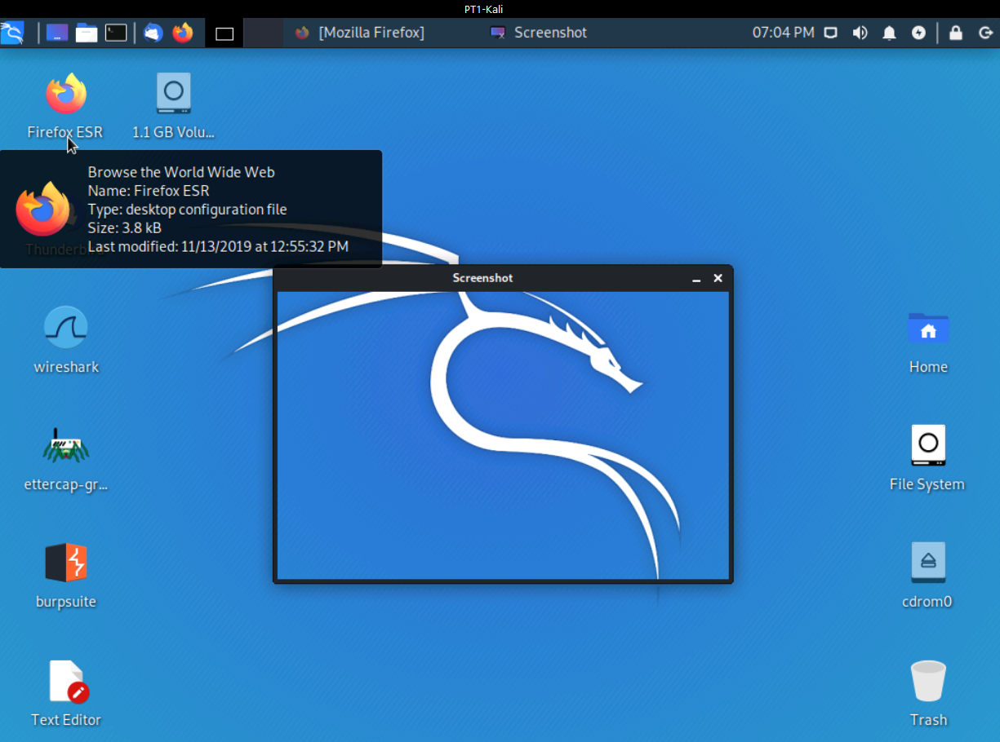

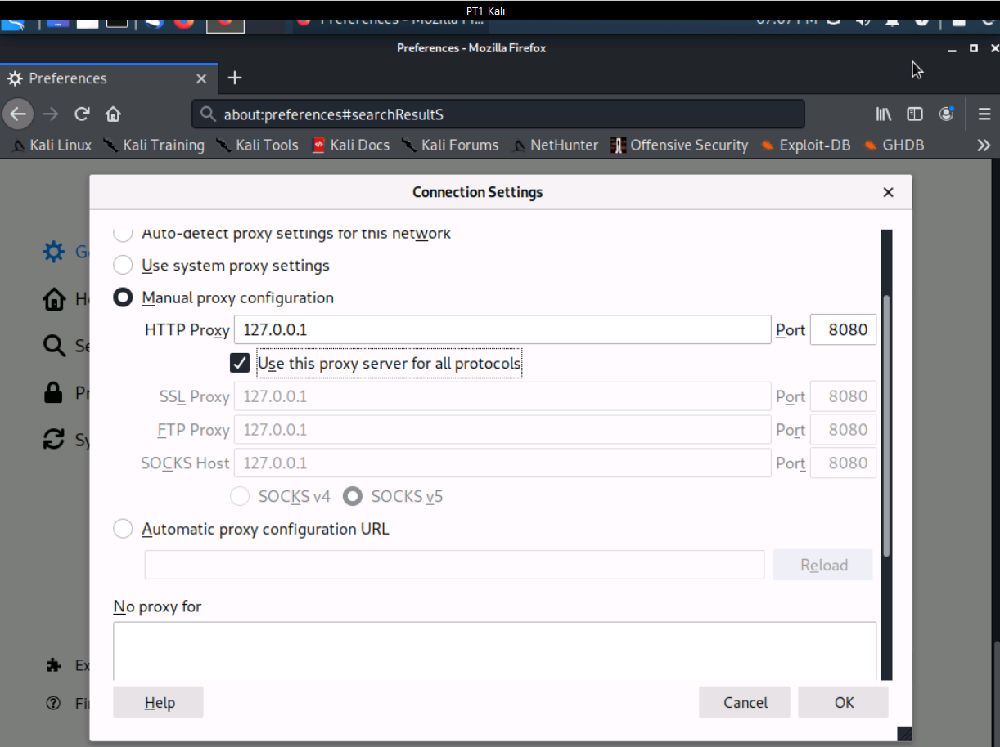

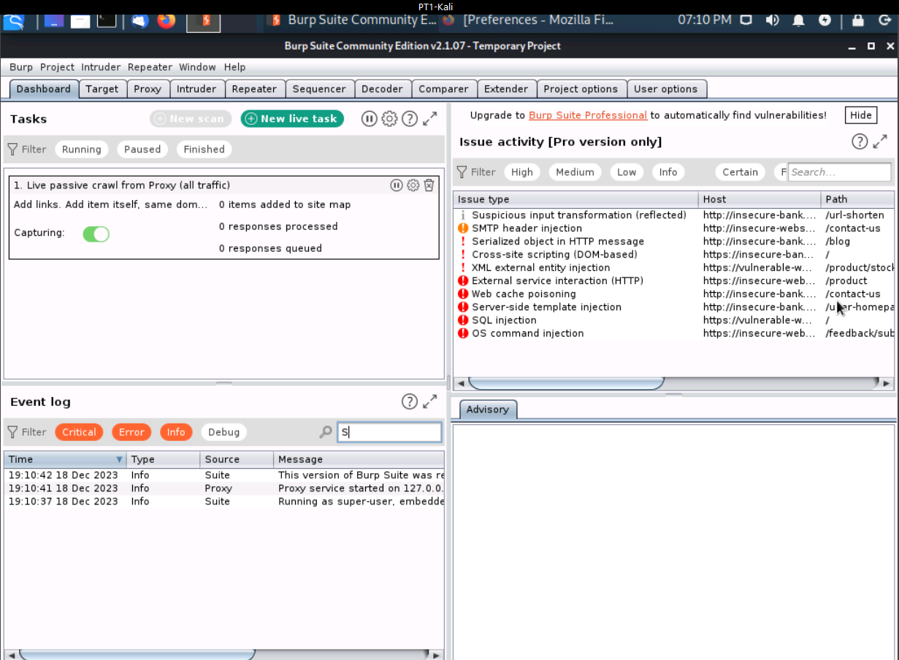

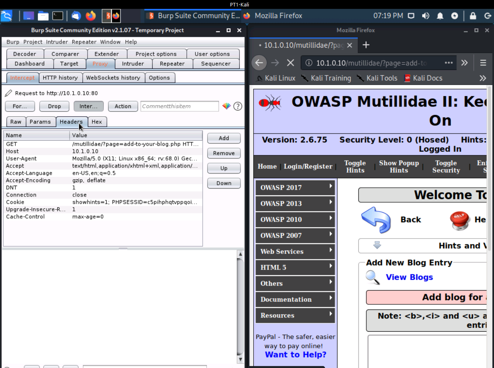

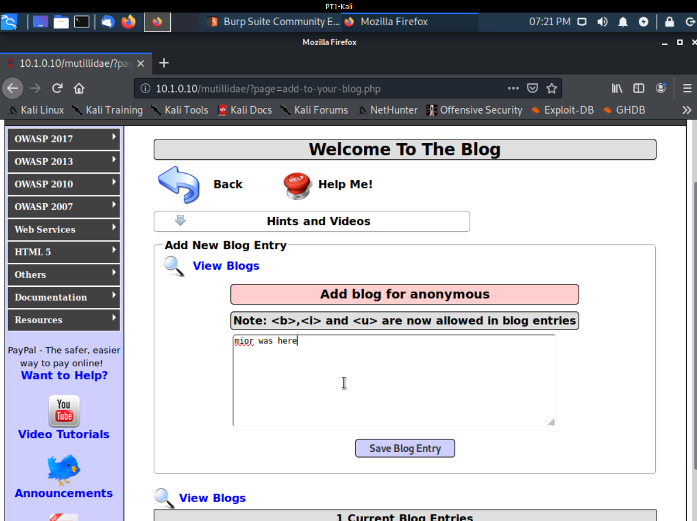

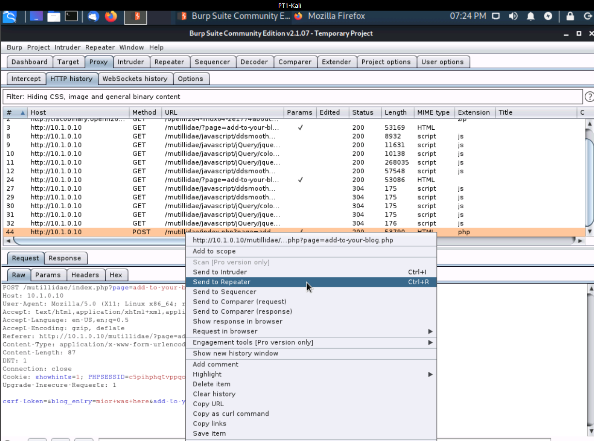

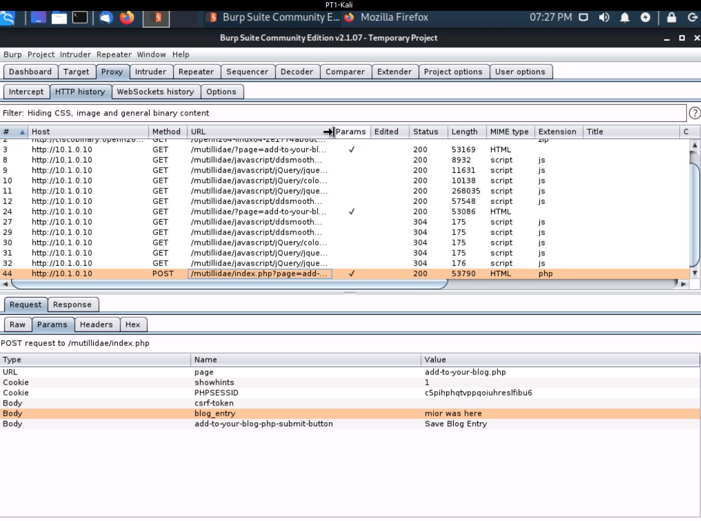

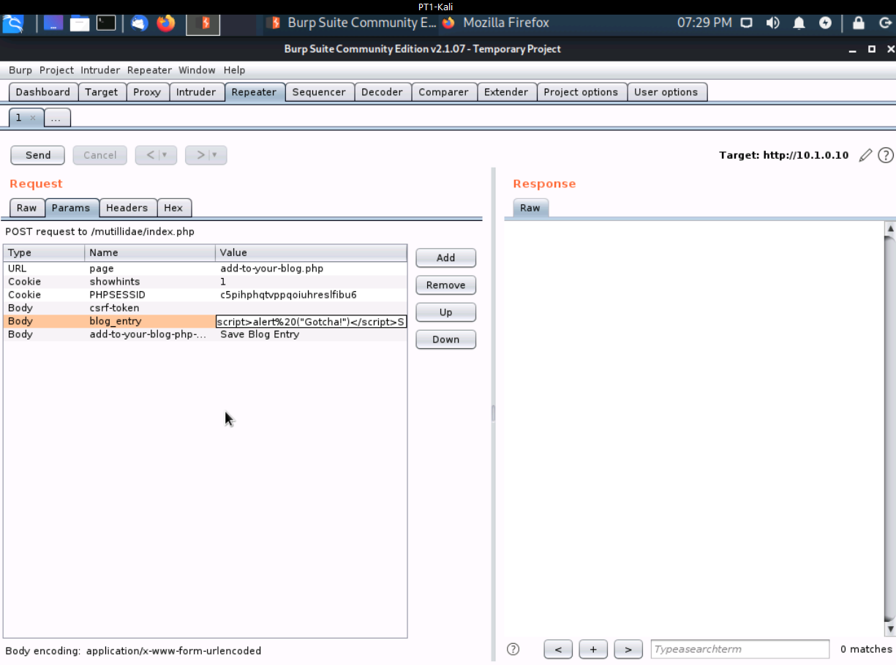

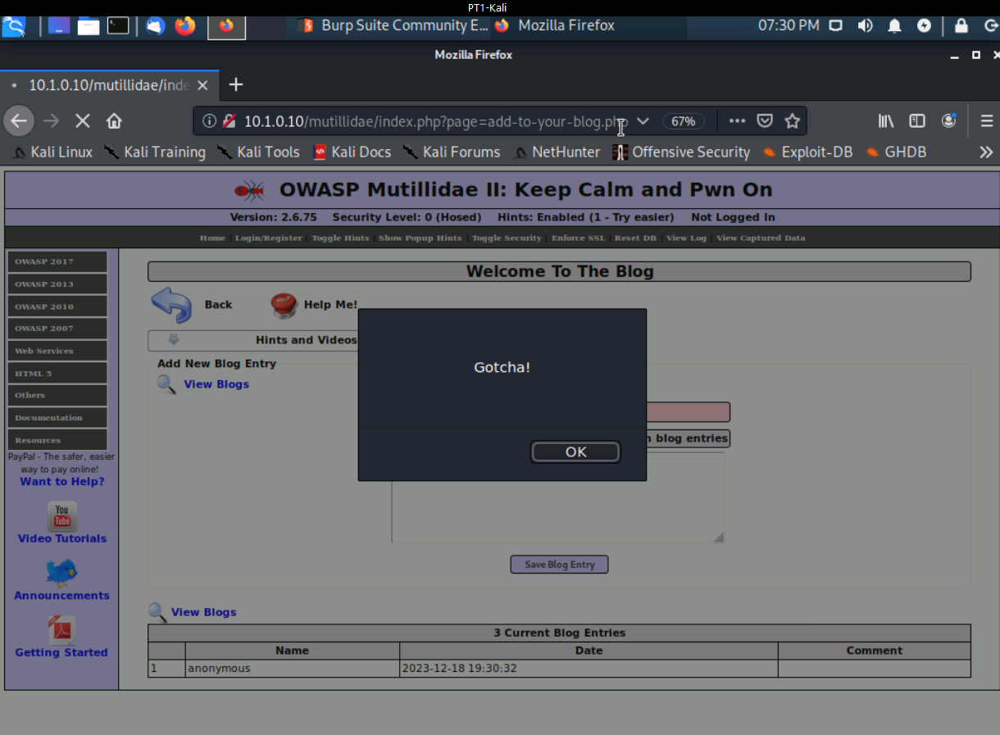

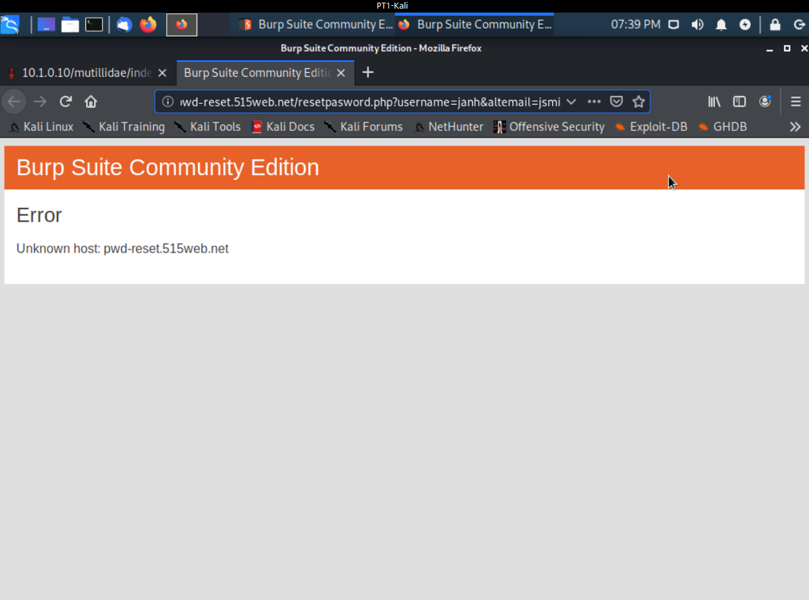

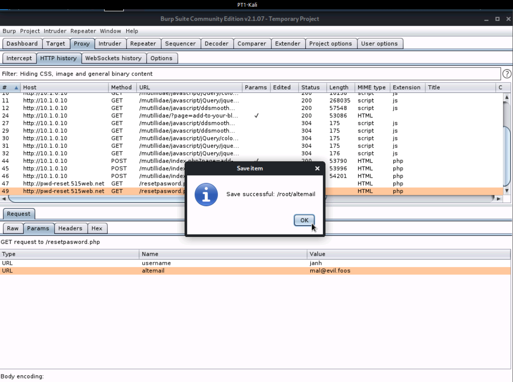
